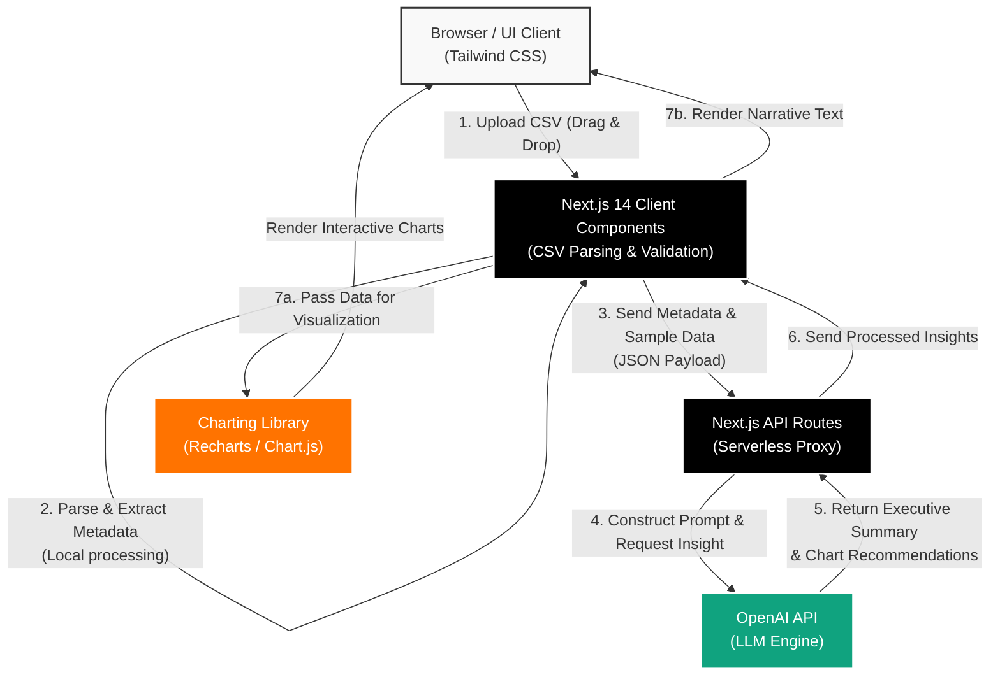

<div align="center">
  <h1>🚀 AI-Powered Data Analytics Dashboard</h1>
  <p><strong>Transforming raw CSV data into actionable, executive-level insights instantly.</strong></p>

  [](https://nextjs.org/)
  [](https://openai.com/)
  [](https://tailwindcss.com/)
  [](https://www.typescriptlang.org/)
</div>

<br />

> **The Problem:** Modern enterprises generate massive amounts of data, but extracting meaningful insights requires days of manual processing by data teams.  
> **The Solution:** A serverless, AI-driven dashboard that ingests raw data and outputs dynamic visualizations alongside narrative executive summaries in seconds.

## ✨ Key Features

| Feature | Description |
| :--- | :--- |
| 🧠 **AI Insights Engine** | Automates the extraction of statistical narratives and hidden anomalies without manual SQL queries. |
| 📊 **Interactive Charts** | Intelligent, dynamic data visualization that automatically selects the best chart type based on your data structure. |
| 📑 **Executive Summaries** | Generates real-time, human-readable reports using OpenAI's LLMs tailored for C-Level decision-makers. |
| ⚡ **Client-Side Heavy Lifting** | Drastically reduces upload bottlenecks by parsing large CSV files directly in the browser. |

## 🏗 System Architecture

The application is built on a scalable, modern architecture utilizing a secure serverless proxy to protect AI integration layers.



## 💻 Tech Stack

- **Framework:** [Next.js 14 (App Router)](https://nextjs.org/) for full-stack serverless capabilities.
- **AI Integration:** [OpenAI SDK](https://platform.openai.com/docs/libraries) for Natural Language Processing & Summarization.
- **Styling:** [Tailwind CSS](https://tailwindcss.com/) for rapid, utility-first UI development.
- **Language:** [TypeScript](https://www.typescriptlang.org/) for robust, type-safe code.

## 🚀 Getting Started

Follow these instructions to set up the project locally.

### Prerequisites
- Node.js 18.17 or later
- An active OpenAI API Key

### Installation

1. **Clone the repository:**
   ```bash
   git clone https://github.com/yourusername/ai-powered-data-dashboard.git
   cd ai-powered-data-dashboard
   ```

2. **Install dependencies:**
   ```bash
   npm install
   ```

3. **Configure Environment Variables:**
   Create a `.env.local` file in the root directory and add your API key:
   ```env
   OPENAI_API_KEY=your_openai_api_key_here
   ```

4. **Run the development server:**
   ```bash
   npm run dev
   ```

5. **Open the App:**
   Navigate to [http://localhost:3000](http://localhost:3000) in your browser.

## 💎 Why This Project?

This application serves as a prime example of an **enterprise-grade solution** designed to accelerate decision-making processes. By eliminating the friction between raw data ingestion and actionable insights, it empowers product managers and executives to make highly informed, data-driven decisions with zero technical overhead. The integration of modern serverless architecture guarantees high scalability while ensuring rigorous data privacy standards.
