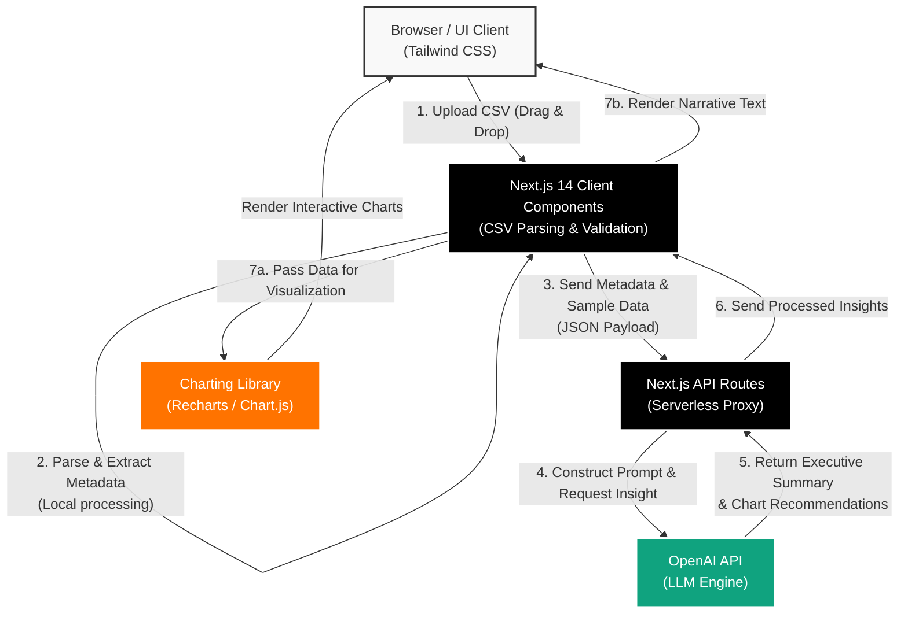
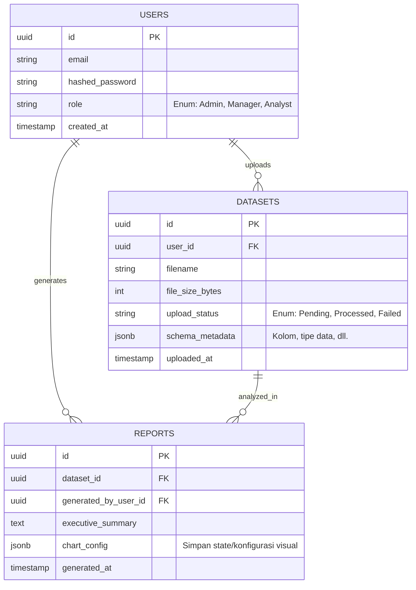

# Product Requirements Document (PRD): AI Data Dashboard

## 1. Executive Summary

Di era bisnis modern yang digerakkan oleh data, kecepatan dalam mengekstraksi *insight* dari *raw data* merupakan keunggulan kompetitif yang krusial. AI Data Dashboard adalah solusi analitik komprehensif yang dirancang untuk mengotomatisasi proses ekstraksi *insight* dan visualisasi data, menjembatani kesenjangan antara data mentah (CSV) dan keputusan strategis tingkat eksekutif.

Aplikasi ini tidak hanya berfungsi sebagai alat visualisasi konvensional, tetapi juga mengintegrasikan kecerdasan buatan (melalui ekosistem OpenAI) untuk menghasilkan analisis diagnostik dan ringkasan eksekutif secara seketika (*real-time*). Proyek ini memvalidasi kapabilitas teknis dan strategis kelas dunia, membuktikan transisi yang solid dari *developer* tunggal menjadi *Global Data Specialist* yang mampu merancang arsitektur dan memberikan solusi bernilai tinggi ($60-$120/hour) bagi *enterprise clients*.

## 2. Target Audience & User Personas

Sistem ini dirancang secara spesifik untuk memecahkan *pain points* klien bisnis tingkat menengah hingga *enterprise* yang menuntut efisiensi maksimal dan *Return on Investment* (ROI) yang terukur.

**User Persona 1: The C-Level Executive (CEO/COO/CMO)**
*   **Profil:** Pengambil keputusan strategis dengan waktu sangat terbatas. Tidak selalu memiliki latar belakang teknis/data *science* yang mendalam, namun sangat bergantung pada data untuk menavigasi arah perusahaan.
*   **Pain Points:** Laporan data internal seringkali terlalu kompleks, lambat disajikan, dan membutuhkan waktu berhari-hari untuk disusun oleh tim *data analyst*.
*   **Kebutuhan:** Ringkasan naratif (*Executive Summary*) yang *to-the-point*, akurat, dan secara proaktif menyoroti anomali, tren, atau peluang bisnis utama beberapa detik setelah data dimasukkan ke sistem.

**User Persona 2: The Data-Driven Product/Operations Manager**
*   **Profil:** Profesional yang berinteraksi dengan *dataset* bervolume menengah setiap hari untuk memantau metrik performa operasional atau produk.
*   **Pain Points:** Terlalu banyak menghabiskan siklus kerja yang berharga hanya untuk membersihkan data dan mengatur *chart* repetitif di Excel atau Tableau.
*   **Kebutuhan:** *Dashboard* interaktif dengan kemampuan *drill-down*, *upload* data tanpa friksi (drag & drop CSV), dan kemampuan memancing *insight* tersembunyi dari data dengan cepat.

## 3. Product Features & Requirements

Fitur-fitur ini dikurasi secara ketat untuk memastikan *Minimum Viable Product* (MVP) yang *powerful*, sekaligus mendefinisikan *roadmap* iterasi masa depan yang jelas.

### Core / Must-Have Features
*   **Intelligent CSV Processing:** Modul *upload drag-and-drop* dengan UX premium yang mampu menerima file CSV, secara otomatis mem-parsing skema (kolom, tipe data), dan melakukan tahap pra-pemrosesan data dasar secara instan (misal: identifikasi nilai *null*).
*   **Automated Executive Summaries (OpenAI Integration):** Sistem secara otomatis mengekstraksi statistik deskriptif dari data yang diunggah, mengirimkan agregasi data (bukan *raw data* sensitif) ke OpenAI API, dan men-generate laporan naratif komprehensif (misal: "Penjualan Q3 turun 15% dibandingkan Q2, terutama didorong oleh sektor ritel regional...").
*   **Dynamic & Interactive Data Visualization:** *Dashboard* adaptif dengan komponen *chart* interaktif (Bar, Line, Pie, Scatter) yang cerdas merekomendasikan dan merender jenis visualisasi terbaik secara otomatis berdasarkan metrik yang dominan dari data.
*   **Natural Language Data Insights:** Kemampuan bagi *user* untuk mendapatkan poin-poin analisis tajam tanpa harus menyusun *query* SQL secara manual, ditangani sepenuhnya oleh kecerdasan AI.

### Nice-to-Have Features (Future Roadmap)
*   **Direct Database Connectors:** Integrasi langsung ke RDBMS modern (PostgreSQL, MySQL) atau *Data Warehouse* (Snowflake, BigQuery) untuk *real-time sync* menggantikan limitasi file CSV.
*   **Natural Language Query (NLQ) Chatbot:** *Interface chat* di mana eksekutif dapat bertanya (contoh: "Bandingkan pertumbuhan *revenue* Q1 dan Q2") dan sistem merender visualisasi atau *text answer* secara instan.
*   **Export to Executive PDF/Report:** Modul pembuatan laporan otomatis yang mengubah visualisasi *dashboard* dan narasi AI ke dalam format PDF dengan *styling* korporat yang profesional.
*   **Role-Based Access Control (RBAC):** Sistem manajemen kontrol akses *enterprise-grade* untuk memastikan keamanan data antar pemangku kepentingan.

## 4. Non-Functional Requirements

Arsitektur aplikasi dirancang untuk *scale-ability* elastis dan eksekusi latensi rendah, mencerminkan standar *engineering enterprise-grade*.

*   **Performance (Web Vitals):** *First Input Delay* (FID) dan *Largest Contentful Paint* (LCP) harus sangat optimal. Render inisial UI *dashboard* harus terjadi di bawah 1 detik (*sub-second*).
*   **Processing Scalability:** Arsitektur harus sanggup menangani pemrosesan CSV secara asinkron tanpa memblokir *Main Thread* di *client-side*. Eksekusi AI tidak boleh menyebabkan *timeout* pada sisi *frontend*.
*   **Security & Data Privacy:** Harus mematuhi standar keamanan terbaik. Sistem tidak boleh menyimpan *raw data* dari CSV pengguna di server/database secara permanen dalam lingkup MVP ini. Hanya metadata dan hasil agregasi anonim yang diteruskan ke layer AI (OpenAI) untuk menjaga kerahasiaan (*enterprise compliance*).
*   **UI/UX Responsiveness:** Antarmuka harus *pixel-perfect* dan dioptimalkan sebagai *Command Center* di resolusi Desktop (*ultrawide ready*), namun tetap memiliki kemampuan degradasi responsif yang elegan (*graceful fallback*) di perangkat Tablet.

## 5. Tech Stack Justification

Pemilihan teknologi ini adalah keputusan strategis yang secara presisi menyeimbangkan performa tinggi, *development speed*, dan *maintainability* level *enterprise*.

*   **Next.js 14 (App Router)**
    *   *Strategic Rationale:* Next.js menyediakan fondasi arsitektur *full-stack* modern dalam satu *codebase*. Pemanfaatan *React Server Components* (RSC) secara drastis memangkas ukuran *bundle* JavaScript di *client*, memberikan *load time* instan yang esensial untuk aplikasi berbasis *dashboard* interaktif. Fitur API Routes memudahkan pembuatan lapisan proksi yang aman untuk berkomunikasi dengan model AI tanpa mengekspos API Key ke *client*.
*   **OpenAI SDK**
    *   *Strategic Rationale:* Elemen kunci dari nilai jual aplikasi ini adalah *Actionable Intelligence*. Memanfaatkan *Large Language Models* (LLMs) via ekosistem OpenAI mengubah paradigma pembuatan laporan dari hitungan hari menjadi detik. Kemampuan API untuk secara akurat menyimpulkan konteks dari *dataset* dan menghasilkan *executive summary* adalah fitur *killer* yang tidak bisa disimulasikan secara efisien oleh algoritma heuristik tradisional.
*   **Tailwind CSS**
    *   *Strategic Rationale:* Dalam B2B *SaaS* atau ekosistem *Enterprise*, desain antarmuka yang presisi, modern, dan memberikan *trust* adalah sebuah keharusan. Tailwind CSS menjamin arsitektur gaya yang *utility-first* dan sangat *scalable* tanpa *bloat* CSS yang sulit dikelola. Dikombinasikan dengan integrasi komponen pradesain (*Headless UI* atau *shadcn/ui*), *stack* ini memastikan waktu iterasi UI yang luar biasa cepat namun tetap menghasilkan antarmuka yang sangat premium, dinamis, dan berkelas.

## 6. System Architecture & Data Flow Visualizations

### 6.1. System Architecture & Data Flow

Diagram di bawah ini memetakan alur pemrosesan dari antarmuka pengguna hingga integrasi AI dan *rendering* visualisasi.

**Penjelasan Teknis Efisiensi Alur:**
*   **Client-Side Heavy Lifting:** Parsing file CSV berukuran besar dilakukan langsung di *browser* (*Frontend*). Ini menghilangkan *bottleneck* unggahan (*upload latency*), mempercepat *feedback loop* ke pengguna, dan menekan biaya server secara signifikan.
*   **Secure API Proxying:** Lapisan *Backend* (*Next.js API Routes*) bertindak sebagai perantara yang memastikan *API Key* OpenAI tersimpan aman di sisi *server*, melindunginya dari akses publik.
*   **Data Privacy & Token Efficiency:** Daripada mengirimkan seluruh data mentah (*raw data*) yang memakan biaya besar, sistem hanya menyusun metrik ringkas (skema kolom, tipe data, sampel data acak) untuk dikirim ke API OpenAI. Ini memastikan efisiensi *token* tingkat maksimum sekaligus menjaga kepatuhan privasi (*compliance*).

### 6.2. Entity Relationship Diagram (ERD) - Future Roadmap

Sebagai persiapan transisi dari iterasi MVP (tanpa basis data) ke sistem produksi penuh (*production-grade*), ini adalah rancangan fondasi arsitektur basis data relasional.

**Penjelasan Teknis Efisiensi Skema:**
*   **Pendekatan Relasional Terdistribusi (UUID):** Penggunaan *Universally Unique Identifier* (UUID) alih-alih *Integer Auto-Increment* memberikan kemudahan luar biasa untuk migrasi, replikasi data masa depan, dan mencegah pihak luar menerka (*scraping*) seberapa banyak pengguna/dataset di dalam sistem.
*   **RBAC Skalabel:** Hubungan kardinalitas *One-to-Many* memastikan bahwa laporan dan data mentah terisolasi berdasarkan pengunggah (`user_id`). Struktur ini esensial untuk mendirikan arsitektur *Multi-Tenant* SaaS *B2B*.
*   **Fleksibilitas JSONB:** CSV yang diunggah oleh entitas bisnis tidak akan pernah seragam strukturnya. Penggunaan kolom tipe `JSONB` pada PostgreSQL memberikan fleksibilitas NoSQL pada database relasional yang tangguh; skema dapat berubah-ubah setiap saat tanpa perlu migrasi *database* (*alter table*) yang berisiko merusak sistem produksi.
